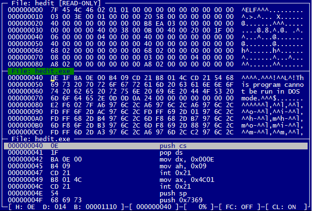

# HEdit 4

HEdit is a small console-based hex editor with a focus on cross-platform reverse engineering.
It is designed to run and tested on Windows, Linux, Rasperry Pi and MacOS X.

  

## Features

* Edit up to five files simultaneously
* Highlight differences in visual compare mode
* Script language for visualizing data structures
* Various search modes including search for differences
* 16/32bit Disassembler
* Usable on disk devices (like /dev/sda1)

## Directory structure

<pre>
.
├─ bin          The output directory for the binaries (created during build process)
├─ build        The build scripts and project files (Makefile, VS2019, etc.)
├─ scripts      Some HEdit scripts (see SCRIPT.md)
├─ src          The source code (including test sources)
├─ test-data    Some test data for the unit tests (you guessed it)
└─ tools        Tool configurations for additional tools, see <a href="#other-tools">below</a>
</pre>

## Supported compilers

HEdit should be compatible with every compiler that supports C++14.
It was confirmed working with the following compilers:

* Visual Studio 2019 (16.8.3)
* g++ (Debian 4.9.2-10+deb8u2) 4.9.2
* g++ (Debian 8.3.0-6) 8.3.0
* g++ (Ubuntu 9.3.0-17ubuntu1~20.04) 9.3.0
* g++ (Raspbian 8.3.0-6+rpi1) 8.3.0
* g++ (SUSE Linux) 7.5.0

## Other tools 

The project contains configurations for the following tools:

* [Doxygen](https://www.doxygen.nl/)  
You can use the Doxyfile to create a full source code documentation.
* [Cppcheck](http://cppcheck.sourceforge.net/)  
You can use Cppcheck with the included config file to perform a static code analysis.
* [cpplint](https://github.com/cpplint/cpplint)  
You can use cpplint with the included config file on the .cpp and .hpp files in the src folder.

## FAQ

### How do I build HEdit on Linux?

Assuming your build environment for C++ is ready, just go to `./build/make/` and execute `make`.
Otherwise you need to install `g++`, `libncurses5-dev` and `make`.

### How do I build HEdit on Windows?

Using Visual Studio, just go to `./build/vs19/` and use the solution file `hedit.sln`.
You will need to have "C++ build tools" installed.

### Do I need any external libraries to build HEdit from scratch?

No, the only dependency is [ncurses](https://invisible-island.net/ncurses/) (and only if not using Windows).
For the tests, the [Googletest](https://github.com/google/googletest) framework is used.

### I can see there are tests but they are not built using the Makefile. Why?

Because the tests are currently only built using the Visual Studio 2019 solution.

### Why is the first version v4.2.0?

Because the project is quite old and was just moved to GitHub recently.

### My screen is quite large, can I edit more than five files simultaneously?

Yes, but only by modifying the source code. You need to change the constant HE_MAX_EDITORS and rebuild HEdit.
